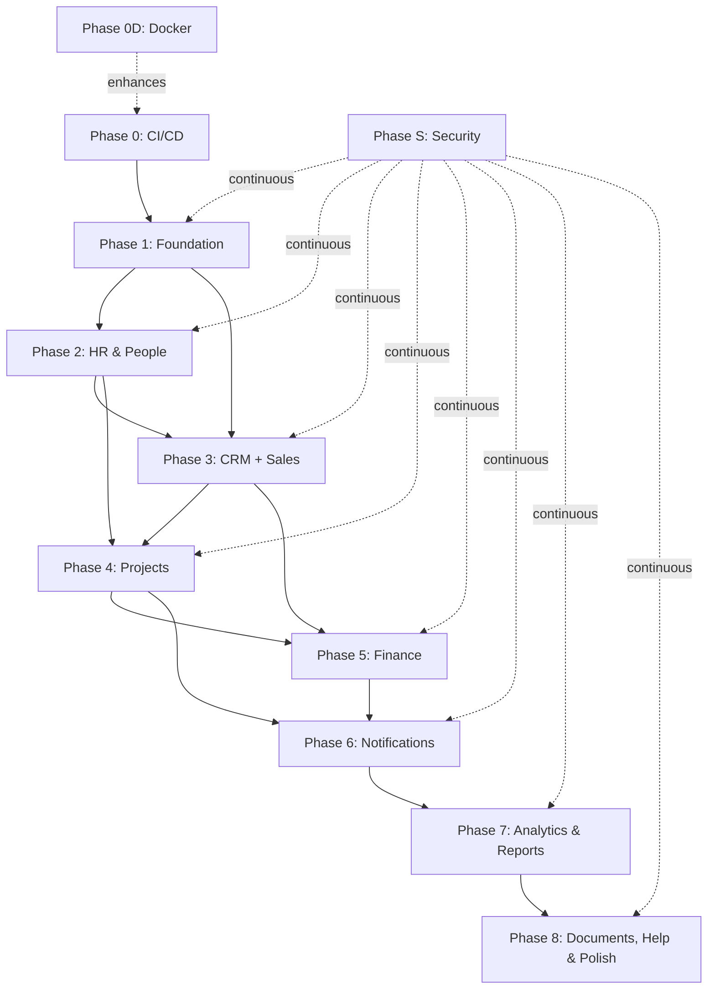

# SENYX ERP — Master Implementation Plan

## Overview

This is the master implementation plan for the SENYX ERP system. The plan is divided into **8 major phases + 2 cross-cutting phases** (CI/CD & Security), covering all 37 database tables, 105 API routes, 15 modules, and the complete frontend.

**Estimated Total Duration: 18–26 weeks** (single developer) / **10–14 weeks** (2–3 developers)

---

## Phase Map

```
┌─────────────────────────────────────────────────────────────────────────┐
│                        CROSS-CUTTING (Continuous)                       │
│  Phase 0: CI/CD & DevOps Infrastructure                                │
│  Phase 0D: Docker Containerization (Dev & Self-Host)                   │
│  Phase S: Security Hardening (applied at every phase)                  │
└─────────────────────────────────────────────────────────────────────────┘

┌────────────┐   ┌────────────┐   ┌────────────┐   ┌────────────┐
│  Phase 1   │──►│  Phase 2   │──►│  Phase 3   │──►│  Phase 4   │
│ Foundation │   │  HR/People │   │ CRM+Sales  │   │  Projects  │
│ Auth+RBAC  │   │  Source of │   │  Pipeline  │   │  Board+    │
│ Audit+Core │   │  Truth     │   │  Deals     │   │  Time+Pay  │
│ 2-3 weeks  │   │ 1-2 weeks  │   │ 2-3 weeks  │   │ 3-4 weeks  │
└────────────┘   └────────────┘   └────────────┘   └────────────┘
                                                          │
┌────────────┐   ┌────────────┐   ┌────────────┐         │
│  Phase 7   │◄──│  Phase 6   │◄──│  Phase 5   │◄────────┘
│ Analytics  │   │  Notif+    │   │  Finance   │
│ Reports    │   │  Reminders │   │  Invoices  │
│ Audit UI   │   │  Emails    │   │  Expenses  │
│ 2-3 weeks  │   │ 1-2 weeks  │   │ 2-3 weeks  │
└────────────┘   └────────────┘   └────────────┘
      │
      ▼
┌────────────┐
│  Phase 8   │
│ Documents  │
│ Help/Docs  │
│ Backups    │
│ Polish     │
│ 1-2 weeks  │
└────────────┘
```

---

## Phase Summary Table

| Phase | Name | Duration | Tables | APIs | Frontend Pages | Dependencies |
|---|---|---|---|---|---|---|
| **0** | CI/CD & DevOps | Week 1 (then continuous) | — | — | — | None |
| **0D** | Docker Containerization | 1 day | — | — | — | None |
| **S** | Security Hardening | Continuous | — | — | — | Phase 0 |
| **1** | Foundation (Auth + RBAC + Audit) | 2–3 weeks | 6 | 16 | Login, Settings | None |
| **2** | HR & People | 1–2 weeks | 10 | 22 | HR Module | Phase 1 |
| **3** | CRM + Sales | 2–3 weeks | 8 | 20 | CRM + Sales | Phase 1, 2 |
| **4** | Projects (Core + Board + Time + Payments) | 3–4 weeks | 9 | 25 | Projects Module | Phase 1, 2, 3 |
| **5** | Finance | 2–3 weeks | 5 | 12 | Finance Module | Phase 3, 4 |
| **6** | Notifications & Reminders | 1–2 weeks | 2 | 3 | Notification Center | Phase 1–5 |
| **7** | Analytics, Reports & Audit UI | 2–3 weeks | 0 | 5 | Analytics + Audit | Phase 1–6 |
| **8** | Documents, Help, Backups & Polish | 1–2 weeks | 1 | 3 | Help, Documents | Phase 1–7 |

**Totals: 37 tables | 105+ API routes | 15 modules**

---

## Detailed Phase Plans

Each phase has its own detailed document:

| Document | Contents |
|---|---|
| [Phase 0 — CI/CD & DevOps](./phase_0_cicd_devops.md) | Repository setup, GitHub Actions, deployment pipelines, environments |
| [Phase 0D — Docker](./phase_0d_docker.md) | Local dev (Compose), CI testing, self-hosting deployment option |
| [Phase S — Security Hardening](./phase_s_security.md) | Authentication hardening, encryption, RLS, input validation, OWASP protections |
| [Phase 1 — Foundation](./phase_1_foundation.md) | Auth, Users, Roles, Permissions, Sessions, Audit, Settings, Dashboard shell |
| [Phase 2 — HR & People](./phase_2_hr_people.md) | Employees, Designations, Departments, Skills, Leave, Payroll, Reviews |
| [Phase 3 — CRM & Sales](./phase_3_crm_sales.md) | Accounts, Contacts, Interactions, Activities, Deals, Pipeline, Quotes |
| [Phase 4 — Projects](./phase_4_projects.md) | Projects, Board, Tasks, Assignments, Time Clock, Milestones, Payment Schedule |
| [Phase 5 — Finance](./phase_5_finance.md) | Invoices, Expenses, Payments, Subscriptions, Milestone→Invoice flow |
| [Phase 6 — Notifications & Reminders](./phase_6_notifications.md) | In-app notifications, Email dispatch, Scheduled reminders, Due-date digests |
| [Phase 7 — Analytics & Reports](./phase_7_analytics_reports.md) | Dashboards, KPI widgets, Filter engine, Reports, Audit log viewer |
| [Phase 8 — Documents, Help & Polish](./phase_8_documents_help_polish.md) | R2 document management, Help/Manual, Database backups, Final polish |

---

## Dependency Graph



---

## Milestone Checkpoints

| Milestone | After Phase | Success Criteria |
|---|---|---|
| **M1 — Core Platform** | Phase 1 | Users can login, roles assigned, audit trail working, settings configurable |
| **M2 — People Ready** | Phase 2 | Employees created in HR, designations/departments set up, leave system functional |
| **M3 — Sales Pipeline** | Phase 3 | Deals flowing through pipeline, CRM contacts managed, won deals ready for project creation |
| **M4 — Project Delivery** | Phase 4 | Kanban board working, time tracking active, payment milestones configured |
| **M5 — Financial Ops** | Phase 5 | Invoices generated from milestones, expenses tracked, payments recorded |
| **M6 — Automated Ops** | Phase 6 | Due-date emails sending, in-app notifications active |
| **M7 — Business Intelligence** | Phase 7 | Dashboards live, reports exportable, audit log browsable |
| **M8 — Production Ready** | Phase 8 | Documents uploading, help content available, backups automated, system polished |

---

## Risk Mitigation

| Risk | Mitigation |
|---|---|
| Supabase free-tier limits | Monitor usage; plan for paid tier if needed |
| Complex RLS policies slow queries | Test with realistic data volumes; optimize policies early |
| Audit log volume growth | Implement archival strategy from Phase 1; indexed queries |
| Netlify free-tier build limits | Cache dependencies; minimize builds |
| Single developer bottleneck | Phase 0 CI/CD enables parallel work if team grows |
| Scope creep | Strict adherence to SRS requirements; defer "nice-to-haves" to post-v1 |

---

*Navigate to individual phase documents for detailed task breakdowns, code patterns, and verification steps.*
