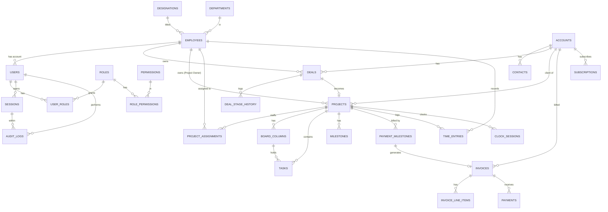

# Technical Design Document (TDD)
## Enterprise Resource Planning (ERP) System
### SENYX Software (Pvt) Ltd

| Field | Value |
|---|---|
| **Company** | SENYX Software (Pvt) Ltd |
| **Document** | Technical Design Document |
| **Companion** | SRS v1.1 |
| **Version** | 1.0 (Final) |
| **Database** | PostgreSQL |
| **Stack** | Next.js (App Router, TypeScript) · Supabase (Postgres + Auth + RLS) · Cloudflare R2 (documents) · Resend (email) |

---

## Table of Contents

1. [Architecture Overview](#1-architecture-overview)
2. [Technology Decisions](#2-technology-decisions)
3. [Conventions](#3-conventions)
4. [Enumerations](#4-enumerations)
5. [Database Schema — Identity, RBAC & Sessions](#5-database-schema--identity-rbac--sessions)
6. [Database Schema — HR & People](#6-database-schema--hr--people)
7. [Database Schema — CRM](#7-database-schema--crm)
8. [Database Schema — Sales](#8-database-schema--sales)
9. [Database Schema — Projects](#9-database-schema--projects)
10. [Database Schema — Finance](#10-database-schema--finance)
11. [Database Schema — Platform](#11-database-schema--platform)
12. [Entity Relationships (ERD — core)](#12-entity-relationships-erd--core)
13. [Indexing Strategy](#13-indexing-strategy)
14. [Row-Level Security (RLS) & Access Enforcement](#14-row-level-security-rls--access-enforcement)
15. [Validation Rules](#15-validation-rules)
16. [API Design & Route Catalogue](#16-api-design--route-catalogue)
17. [TypeScript Interfaces](#17-typescript-interfaces)
18. [Auth, Audit & Reminder Implementation](#18-auth-audit--reminder-implementation)
19. [Security, Privacy & Backups](#19-security-privacy--backups)
20. [Appendices](#20-appendices)

---

## 1. Architecture Overview

A single Next.js (App Router) application provides both the UI (React Server Components + client components) and the server API (route handlers under `/app/api`). All business logic and data access run server-side. PostgreSQL (Supabase) is the system of record; Cloudflare R2 stores binary documents; Resend sends transactional email; a scheduled job runner drives due-date reminders and report schedules.

```
Browser (React)
    |  HTTPS
Next.js App Router  →  Route Handlers (/app/api/*)  →
Service layer  →  PostgreSQL (Supabase)
    |                        |  (auth, RBAC, audit)
    |
    |                        ├→ Cloudflare R2 (documents)
    └→ Row-Level Security
                             ├→ Resend (email)
                             └→ Scheduler (cron)  →
reminders / reports
```

**Enforcement layering** — every state change passes through the service layer, which (1) checks RBAC, (2) executes the operation inside a transaction, (3) writes an immutable audit entry, all under database Row-Level Security as a second line of defence.

---

## 2. Technology Decisions

| Concern | Decision | Rationale |
|---|---|---|
| Framework | Next.js App Router + TypeScript | Single deployable, API-first, server actions/handlers |
| Database | PostgreSQL (Supabase) | Relational integrity, transactions, RLS, free tier permits commercial use |
| ORM / query | Drizzle ORM (TypeScript-first) | Clean typing, plays well with Supabase RLS; Prisma is an acceptable alternative |
| Auth | Supabase Auth (email/password + optional 2FA) | Managed sessions, integrates with RLS via JWT claims |
| Documents | Cloudflare R2 (S3-compatible) | 10 GB free, zero egress; store key + signed URL |
| Email | Resend (behind an `EmailProvider` interface) | Free tier; swappable |
| Hosting | Netlify / Cloudflare Pages | Commercial-use-permitted free hosting |
| IDs | UUID v4 (`gen_random_uuid()`) | Non-guessable, distributed-safe |
| Money | `numeric(14,2)` + ISO-4217 currency code | Exact decimal; avoids float error |
| Scheduler | Platform cron (e.g. GitHub Actions / Netlify scheduled functions) | Free; drives reminders & report jobs |

**Resolved open questions** (all configurable in settings):

- Milestone completion generates a **draft invoice** requiring review before issue (not auto-issued).
- A dedicated **Auditor** role is available; by default audit access is Admin-only.
- Email provider is **Resend**, abstracted behind `EmailProvider`.
- The project clock enforces **one active clock-in per employee at a time**.

---

## 3. Conventions

### 3.1 Identifiers

- Every table's primary key is `id uuid PRIMARY KEY DEFAULT gen_random_uuid()`.
- Human-facing codes (e.g. `employee_code`, `project.code`, `invoice_number`) are separate, unique, and generated with a readable format.

### 3.2 Timestamps & Time Zones

- All timestamps are `timestamptz` stored in UTC. Display conversion happens in the UI.

### 3.3 Base Columns (present on every business table unless noted)

| Column | Type | Constraints | Notes |
|---|---|---|---|
| `id` | uuid | PK, default `gen_random_uuid()` | |
| `created_at` | timestamptz | NOT NULL, default `now()` | |
| `updated_at` | timestamptz | NOT NULL, default `now()` | Set via trigger on update |
| `deleted_at` | timestamptz | NULL | Soft-delete marker; NULL = active |
| `created_by` | uuid | NULL, FK → `users(id)` | Actor who created the row |
| `updated_by` | uuid | NULL, FK → `users(id)` | Actor who last updated |

### 3.4 Soft Delete

- Business records are never hard-deleted; `deleted_at` is set. All default queries filter `deleted_at IS NULL`.
- Audit and session tables are append-only (no soft delete, no updates).

### 3.5 Money

- **Amounts** — `numeric(14,2)`
- **Currency** — `char(3)` ISO-4217
- **Percentages** — `numeric(5,2)` (0–100)
- **Hours** — `numeric(6,2)`

### 3.6 Audit Pattern

- Every create/update/delete/approve/status-change/clock/login is written to `audit_logs` with before/after JSONB, actor, session, API route, device, and IP (Section 11.3).

---

## 4. Enumerations

Enumerations are implemented as Postgres `CHECK` constraints or enum types, and mirrored as TypeScript string-union types (Section 17).

| Enum | Values |
|---|---|
| `employment_type` | `full_time`, `part_time`, `contract`, `intern` |
| `employee_status` | `active`, `on_leave`, `suspended`, `terminated` |
| `leave_status` | `pending`, `approved`, `rejected`, `cancelled` |
| `account_status` | `prospect`, `active`, `inactive` |
| `interaction_type` | `call`, `email`, `meeting`, `note` |
| `activity_status` | `open`, `in_progress`, `done`, `cancelled` |
| `deal_stage` | `lead`, `qualified`, `proposal`, `negotiation`, `won`, `lost` |
| `deal_status` | `open`, `won`, `lost` |
| `project_type` | `solution`, `product` |
| `billing_type` | `fixed`, `time_materials`, `retainer` |
| `project_status` | `planning`, `active`, `on_hold`, `completed`, `cancelled` |
| `task_priority` | `low`, `medium`, `high`, `urgent` |
| `task_status` | `todo`, `in_progress`, `review`, `done`, `blocked` |
| `milestone_status` | `pending`, `in_progress`, `completed` |
| `payment_milestone_status` | `pending`, `due`, `invoiced`, `paid` |
| `time_source` | `manual`, `clock` |
| `invoice_status` | `draft`, `sent`, `paid`, `overdue`, `void` |
| `expense_status` | `pending`, `approved`, `rejected`, `reimbursed` |
| `payment_method` | `bank_transfer`, `card`, `cash`, `cheque`, `online` |
| `subscription_status` | `trialing`, `active`, `past_due`, `cancelled` |
| `subscription_interval` | `monthly`, `quarterly`, `annual` |
| `notification_channel` | `in_app`, `email` |
| `audit_result` | `success`, `failure` |
| `risk_severity` | `low`, `medium`, `high`, `critical` |
| `risk_status` | `open`, `mitigating`, `closed` |
| `record_scope` | `all`, `own`, `assigned` |
| `permission_action` | `view`, `create`, `edit`, `delete`, `export`, `approve` |

---

## 5. Database Schema — Identity, RBAC & Sessions

### 5.1 `users`

Application account, linked 1–1 to an employee. Authentication delegated to Supabase Auth; this table holds app-level profile/state.

| Column | Type | Constraints | Validation / Notes |
|---|---|---|---|
| `id` | uuid | PK | Matches Supabase auth user id |
| `employee_id` | uuid | NOT NULL, UNIQUE, FK → `employees(id)` | One account per person |
| `email` | citext | NOT NULL, UNIQUE | Valid email format |
| `is_active` | boolean | NOT NULL, default `true` | Deactivate to revoke access |
| `two_factor_enabled` | boolean | NOT NULL, default `false` | |
| `last_login_at` | timestamptz | NULL | |
| | | + base columns | |

### 5.2 `roles`

| Column | Type | Constraints | Validation / Notes |
|---|---|---|---|
| `name` | varchar(50) | NOT NULL, UNIQUE | e.g. Admin, Finance, Project Owner |
| `description` | text | NULL | |
| `is_system` | boolean | NOT NULL, default `false` | System roles cannot be deleted |
| | | + base columns | |

**Seed roles** — Admin, Finance, HR Manager, Sales Lead, Project Owner, Employee, Auditor (optional).

### 5.3 `permissions`

| Column | Type | Constraints | Validation / Notes |
|---|---|---|---|
| `module` | varchar(30) | NOT NULL | e.g. sales, projects, finance, hr, analytics, audit, settings |
| `action` | varchar(20) | NOT NULL, CHECK in `permission_action` | view/create/edit/delete/export/approve |
| `scope` | varchar(10) | NOT NULL, CHECK in `record_scope`, default `'all'` | all/own/assigned |
| `description` | text | NULL | |
| | | UNIQUE(`module`, `action`, `scope`) | |
| | | + base columns | |

### 5.4 `role_permissions` (join)

| Column | Type | Constraints |
|---|---|---|
| `role_id` | uuid | NOT NULL, FK → `roles(id)` ON DELETE CASCADE |
| `permission_id` | uuid | NOT NULL, FK → `permissions(id)` ON DELETE CASCADE |
| | | PK(`role_id`, `permission_id`) |

### 5.5 `user_roles` (join)

| Column | Type | Constraints |
|---|---|---|
| `user_id` | uuid | NOT NULL, FK → `users(id)` ON DELETE CASCADE |
| `role_id` | uuid | NOT NULL, FK → `roles(id)` ON DELETE CASCADE |
| | | PK(`user_id`, `role_id`) |

### 5.6 `sessions`

Append-only. Backs session-duration ("time period staying") and device analytics.

| Column | Type | Constraints | Validation / Notes |
|---|---|---|---|
| `id` | uuid | PK | |
| `user_id` | uuid | NOT NULL, FK → `users(id)` | |
| `started_at` | timestamptz | NOT NULL, default `now()` | |
| `ended_at` | timestamptz | NULL | Set on logout/expiry |
| `duration_seconds` | integer | NULL | Computed on end; >= 0 |
| `ip_address` | inet | NULL | |
| `device` | varchar(60) | NULL | Parsed from user agent |
| `os` | varchar(60) | NULL | |
| `browser` | varchar(60) | NULL | |
| `user_agent` | text | NULL | Raw UA |
| `is_active` | boolean | NOT NULL, default `true` | |
| `created_at` | timestamptz | NOT NULL, default `now()` | No soft delete |

---

## 6. Database Schema — HR & People

### 6.1 `departments`

| Column | Type | Constraints |
|---|---|---|
| `name` | varchar(80) | NOT NULL, UNIQUE |
| `description` | text | NULL |
| | | + base columns |

### 6.2 `designations`

| Column | Type | Constraints | Notes |
|---|---|---|---|
| `title` | varchar(80) | NOT NULL, UNIQUE | Job title only; grants no permissions |
| `description` | text | NULL | |
| | | + base columns | |

### 6.3 `employees`

Single source of truth for people (SRS FR-PPL-01/02). All other modules reference this.

| Column | Type | Constraints | Validation / Notes |
|---|---|---|---|
| `employee_code` | varchar(20) | NOT NULL, UNIQUE | e.g. SNX-0001 |
| `first_name` | varchar(60) | NOT NULL | 1–60 chars |
| `last_name` | varchar(60) | NOT NULL | |
| `email` | citext | NOT NULL, UNIQUE | Valid email |
| `phone` | varchar(30) | NULL | E.164-ish |
| `designation_id` | uuid | NOT NULL, FK → `designations(id)` | Exactly one primary designation |
| `department_id` | uuid | NULL, FK → `departments(id)` | |
| `manager_id` | uuid | NULL, FK → `employees(id)` | Self-reference; no cycles (app-validated) |
| `employment_type` | varchar(15) | NOT NULL, CHECK in `employment_type` | |
| `start_date` | date | NOT NULL | |
| `end_date` | date | NULL | Must be >= start_date |
| `status` | varchar(15) | NOT NULL, CHECK in `employee_status`, default `'active'` | |
| `salary` | numeric(14,2) | NULL | Encrypted at rest; HR/Admin only |
| `bank_details` | jsonb | NULL | Encrypted at rest; HR/Admin only |
| `national_id` | varchar(40) | NULL | Encrypted at rest; HR/Admin only |
| `emergency_contact` | jsonb | NULL | name/phone/relation |
| | | + base columns | |

**CHECK** — `end_date IS NULL OR end_date >= start_date`.

### 6.4 `skills`

| Column | Type | Constraints |
|---|---|---|
| `name` | varchar(60) | NOT NULL, UNIQUE |
| `category` | varchar(40) | NULL |
| | | + base columns |

### 6.5 `employee_skills` (join)

| Column | Type | Constraints | Validation |
|---|---|---|---|
| `employee_id` | uuid | NOT NULL, FK → `employees(id)` | |
| `skill_id` | uuid | NOT NULL, FK → `skills(id)` | |
| `proficiency` | smallint | NOT NULL, CHECK 1–5 | 1=novice, 5=expert |
| `certified` | boolean | NOT NULL, default `false` | |
| `certified_at` | date | NULL | |
| | | PK(`employee_id`, `skill_id`) | |

### 6.6 `leave_types`

| Column | Type | Constraints |
|---|---|---|
| `name` | varchar(40) | NOT NULL, UNIQUE |
| `default_annual_days` | numeric(5,2) | NOT NULL, CHECK >= 0 |
| | | + base columns |

### 6.7 `leave_balances`

| Column | Type | Constraints | Validation |
|---|---|---|---|
| `employee_id` | uuid | NOT NULL, FK → `employees(id)` | |
| `leave_type_id` | uuid | NOT NULL, FK → `leave_types(id)` | |
| `year` | smallint | NOT NULL | e.g. 2026 |
| `balance_days` | numeric(5,2) | NOT NULL, CHECK >= 0 | |
| | | UNIQUE(`employee_id`, `leave_type_id`, `year`) | |

### 6.8 `leave_requests`

| Column | Type | Constraints | Validation |
|---|---|---|---|
| `employee_id` | uuid | NOT NULL, FK → `employees(id)` | |
| `leave_type_id` | uuid | NOT NULL, FK → `leave_types(id)` | |
| `start_date` | date | NOT NULL | |
| `end_date` | date | NOT NULL | >= start_date |
| `days` | numeric(5,2) | NOT NULL, CHECK > 0 | Computed, cannot exceed balance |
| `reason` | text | NULL | |
| `status` | varchar(12) | NOT NULL, CHECK in `leave_status`, default `'pending'` | |
| `approver_id` | uuid | NULL, FK → `employees(id)` | Set on decision |
| `decided_at` | timestamptz | NULL | |
| | | + base columns | |

### 6.9 `payroll_records`

| Column | Type | Constraints | Validation |
|---|---|---|---|
| `employee_id` | uuid | NOT NULL, FK → `employees(id)` | |
| `period_month` | smallint | NOT NULL, CHECK 1–12 | |
| `period_year` | smallint | NOT NULL | |
| `gross` | numeric(14,2) | NOT NULL, CHECK >= 0 | Encrypted at rest |
| `deductions` | numeric(14,2) | NOT NULL, default 0, CHECK >= 0 | |
| `net` | numeric(14,2) | NOT NULL, CHECK >= 0 | gross - deductions |
| `currency` | char(3) | NOT NULL | |
| `components` | jsonb | NULL | Line breakdown |
| `generated_at` | timestamptz | NOT NULL, default `now()` | |
| | | UNIQUE(`employee_id`, `period_year`, `period_month`) | |
| | | + base columns | |

### 6.10 `performance_reviews`

| Column | Type | Constraints | Validation |
|---|---|---|---|
| `employee_id` | uuid | NOT NULL, FK → `employees(id)` | |
| `reviewer_id` | uuid | NOT NULL, FK → `employees(id)` | |
| `period` | varchar(20) | NOT NULL | e.g. 2026-H1 |
| `rating` | smallint | NULL, CHECK 1–5 | |
| `goals` | jsonb | NULL | |
| `notes` | text | NULL | |
| | | + base columns | |

---

## 7. Database Schema — CRM

### 7.1 `accounts`

| Column | Type | Constraints | Validation / Notes |
|---|---|---|---|
| `name` | varchar(120) | NOT NULL | 1–120 chars |
| `industry` | varchar(60) | NULL | |
| `size` | varchar(20) | NULL | e.g. 1-10, 11-50 |
| `website` | varchar(200) | NULL | Valid URL if present |
| `address` | jsonb | NULL | line1/city/country |
| `status` | varchar(12) | NOT NULL, CHECK in `account_status`, default `'prospect'` | |
| `owner_id` | uuid | NULL, FK → `employees(id)` | Relationship owner |
| | | + base columns | |

### 7.2 `contacts`

| Column | Type | Constraints | Validation |
|---|---|---|---|
| `account_id` | uuid | NOT NULL, FK → `accounts(id)` | |
| `first_name` | varchar(60) | NOT NULL | |
| `last_name` | varchar(60) | NULL | |
| `email` | citext | NULL | Valid email |
| `phone` | varchar(30) | NULL | |
| `title` | varchar(80) | NULL | |
| `is_primary` | boolean | NOT NULL, default `false` | One primary per account (app-validated) |
| | | + base columns | |

### 7.3 `interactions`

| Column | Type | Constraints | Validation |
|---|---|---|---|
| `account_id` | uuid | NULL, FK → `accounts(id)` | account or contact required |
| `contact_id` | uuid | NULL, FK → `contacts(id)` | |
| `type` | varchar(10) | NOT NULL, CHECK in `interaction_type` | |
| `subject` | varchar(160) | NOT NULL | |
| `notes` | text | NULL | |
| `occurred_at` | timestamptz | NOT NULL, default `now()` | |
| `logged_by` | uuid | NOT NULL, FK → `employees(id)` | |
| | | + base columns | |

**CHECK** — `account_id IS NOT NULL OR contact_id IS NOT NULL`.

### 7.4 `activities`

Follow-up tasks; polymorphically related to any record.

| Column | Type | Constraints | Validation |
|---|---|---|---|
| `subject` | varchar(160) | NOT NULL | |
| `type` | varchar(20) | NULL | call/email/todo |
| `due_date` | timestamptz | NULL | |
| `assignee_id` | uuid | NULL, FK → `employees(id)` | |
| `related_type` | varchar(30) | NULL | e.g. account, deal, project |
| `related_id` | uuid | NULL | Polymorphic target |
| `status` | varchar(12) | NOT NULL, CHECK in `activity_status`, default `'open'` | |
| | | + base columns | |

### 7.5 `tags` & `taggables`

**`tags`**

| Column | Type | Constraints |
|---|---|---|
| `name` | varchar(40) | NOT NULL, UNIQUE |
| | | + base columns |

**`taggables`** (polymorphic join)

| Column | Type | Constraints |
|---|---|---|
| `tag_id` | uuid | NOT NULL, FK → `tags(id)` ON DELETE CASCADE |
| `taggable_type` | varchar(30) | NOT NULL |
| `taggable_id` | uuid | NOT NULL |
| | | PK(`tag_id`, `taggable_type`, `taggable_id`) |

---

## 8. Database Schema — Sales

### 8.1 `deals`

| Column | Type | Constraints | Validation / Notes |
|---|---|---|---|
| `name` | varchar(140) | NOT NULL | |
| `account_id` | uuid | NOT NULL, FK → `accounts(id)` | |
| `owner_id` | uuid | NOT NULL, FK → `employees(id)` | "Whose sale" — any employee |
| `amount` | numeric(14,2) | NOT NULL, CHECK >= 0 | Deal value |
| `currency` | char(3) | NOT NULL | |
| `stage` | varchar(14) | NOT NULL, CHECK in `deal_stage`, default `'lead'` | |
| `probability` | numeric(5,2) | NOT NULL, default 0, CHECK 0–100 | |
| `expected_close_date` | date | NULL | |
| `source` | varchar(40) | NULL | |
| `status` | varchar(6) | NOT NULL, CHECK in `deal_status`, default `'open'` | Derived from stage |
| `win_loss_reason` | text | NULL | Required when status won/lost (app) |
| `last_activity_at` | timestamptz | NULL | Drives deal-health |
| `closed_at` | timestamptz | NULL | |
| | | + base columns | |

**Deal-health (computed, not stored)** — `days_in_stage`, `days_since_last_activity`, `risk_flag`.

### 8.2 `deal_stage_history` (append-only)

| Column | Type | Constraints |
|---|---|---|
| `deal_id` | uuid | NOT NULL, FK → `deals(id)` |
| `from_stage` | varchar(14) | NULL |
| `to_stage` | varchar(14) | NOT NULL |
| `changed_by` | uuid | NOT NULL, FK → `users(id)` |
| `changed_at` | timestamptz | NOT NULL, default `now()` |
| | | `id`, `created_at` |

### 8.3 `quotes`

| Column | Type | Constraints | Validation |
|---|---|---|---|
| `deal_id` | uuid | NOT NULL, FK → `deals(id)` | |
| `amount` | numeric(14,2) | NOT NULL, CHECK >= 0 | |
| `currency` | char(3) | NOT NULL | |
| `valid_until` | date | NULL | |
| `status` | varchar(12) | NOT NULL, default `'draft'` | draft/sent/accepted/rejected |
| `document_id` | uuid | NULL, FK → `documents(id)` | Attached PDF |
| | | + base columns | |

---

## 9. Database Schema — Projects

### 9.1 `projects`

| Column | Type | Constraints | Validation / Notes |
|---|---|---|---|
| `code` | varchar(20) | NOT NULL, UNIQUE | e.g. PRJ-0007 |
| `name` | varchar(140) | NOT NULL | |
| `type` | varchar(10) | NOT NULL, CHECK in `project_type` | solution (client) / product (internal) |
| `account_id` | uuid | NULL, FK → `accounts(id)` | Required when type=solution (app) |
| `deal_id` | uuid | NULL, FK → `deals(id)` | Source deal, if any |
| `owner_id` | uuid | NOT NULL, FK → `employees(id)` | The Project Owner (accountable) |
| `billing_type` | varchar(15) | NOT NULL, CHECK in `billing_type` | |
| `status` | varchar(12) | NOT NULL, CHECK in `project_status`, default `'planning'` | |
| `start_date` | date | NULL | |
| `end_date` | date | NULL | >= start_date |
| `budget` | numeric(14,2) | NULL, CHECK >= 0 | |
| `currency` | char(3) | NOT NULL | |
| | | + base columns | |

**CHECK** — `type = 'product' OR account_id IS NOT NULL` (solutions need a client).

### 9.2 `project_assignments` (who worked on which project)

| Column | Type | Constraints | Validation |
|---|---|---|---|
| `project_id` | uuid | NOT NULL, FK → `projects(id)` | |
| `employee_id` | uuid | NOT NULL, FK → `employees(id)` | References HR person |
| `role_on_project` | varchar(40) | NULL | e.g. Developer, QA |
| `allocation_pct` | numeric(5,2) | NULL, CHECK 0–100 | |
| `assigned_at` | timestamptz | NOT NULL, default `now()` | |
| `unassigned_at` | timestamptz | NULL | |
| | | UNIQUE(`project_id`, `employee_id`) WHERE `unassigned_at IS NULL` | Active assignment unique |
| | | + base columns | |

### 9.3 `board_columns`

| Column | Type | Constraints | Validation |
|---|---|---|---|
| `project_id` | uuid | NOT NULL, FK → `projects(id)` | |
| `name` | varchar(40) | NOT NULL | e.g. Backlog, To Do, In Progress, Review, Done |
| `position` | smallint | NOT NULL | Order left-to-right |
| `wip_limit` | smallint | NULL, CHECK >= 0 | Optional WIP cap |
| | | UNIQUE(`project_id`, `position`) | |
| | | + base columns | |

### 9.4 `tasks`

| Column | Type | Constraints | Validation |
|---|---|---|---|
| `project_id` | uuid | NOT NULL, FK → `projects(id)` | |
| `column_id` | uuid | NOT NULL, FK → `board_columns(id)` | Current board column |
| `parent_task_id` | uuid | NULL, FK → `tasks(id)` | Subtask support |
| `title` | varchar(200) | NOT NULL | |
| `description` | text | NULL | |
| `assignee_id` | uuid | NULL, FK → `employees(id)` | |
| `priority` | varchar(8) | NOT NULL, CHECK in `task_priority`, default `'medium'` | |
| `status` | varchar(12) | NOT NULL, CHECK in `task_status`, default `'todo'` | |
| `estimate_hours` | numeric(6,2) | NULL, CHECK >= 0 | |
| `due_date` | date | NULL | |
| `position` | integer | NOT NULL, default 0 | Order within column |
| | | + base columns | |

Board moves update `column_id`/`position` and are captured in `audit_logs` (action `task.move`).

### 9.5 `milestones` (delivery milestones)

| Column | Type | Constraints | Validation |
|---|---|---|---|
| `project_id` | uuid | NOT NULL, FK → `projects(id)` | |
| `name` | varchar(120) | NOT NULL | |
| `description` | text | NULL | |
| `due_date` | date | NULL | |
| `status` | varchar(12) | NOT NULL, CHECK in `milestone_status`, default `'pending'` | |
| `completed_at` | timestamptz | NULL | |
| | | + base columns | |

### 9.6 `payment_milestones` (percentage-based collection)

| Column | Type | Constraints | Validation / Notes |
|---|---|---|---|
| `project_id` | uuid | NOT NULL, FK → `projects(id)` | |
| `name` | varchar(80) | NOT NULL | e.g. "After requirement gathering" |
| `phase` | varchar(60) | NULL | Linked phase label |
| `sequence` | smallint | NOT NULL | Order of collection |
| `percentage` | numeric(5,2) | NOT NULL, CHECK 0–100 | Sum per project must = 100 (app + trigger) |
| `amount` | numeric(14,2) | NOT NULL, CHECK >= 0 | Derived — project value x percentage |
| `currency` | char(3) | NOT NULL | |
| `status` | varchar(10) | NOT NULL, CHECK in `payment_milestone_status`, default `'pending'` | pending → due → invoiced → paid |
| `expected_date` | date | NULL | |
| `invoice_id` | uuid | NULL, FK → `invoices(id)` | Set when invoiced |
| `completed_at` | timestamptz | NULL | When phase marked done |
| | | UNIQUE(`project_id`, `sequence`) | |
| | | + base columns | |

**Business rule** — `SUM(percentage)` per project = 100, enforced by a deferred constraint/trigger and validated in the service layer before activation.

### 9.7 `time_entries`

| Column | Type | Constraints | Validation |
|---|---|---|---|
| `project_id` | uuid | NOT NULL, FK → `projects(id)` | |
| `task_id` | uuid | NULL, FK → `tasks(id)` | |
| `employee_id` | uuid | NOT NULL, FK → `employees(id)` | |
| `work_date` | date | NOT NULL | Not in the future |
| `hours` | numeric(6,2) | NOT NULL, CHECK > 0 AND <= 24 | |
| `description` | text | NULL | |
| `billable` | boolean | NOT NULL, default `true` | |
| `source` | varchar(6) | NOT NULL, CHECK in `time_source`, default `'manual'` | manual or clock |
| `clock_session_id` | uuid | NULL, FK → `clock_sessions(id)` | Set when source=clock |
| | | + base columns | |

### 9.8 `clock_sessions` (project time clock / attendance clock)

| Column | Type | Constraints | Validation |
|---|---|---|---|
| `project_id` | uuid | NOT NULL, FK → `projects(id)` | |
| `task_id` | uuid | NULL, FK → `tasks(id)` | |
| `employee_id` | uuid | NOT NULL, FK → `employees(id)` | |
| `clock_in_at` | timestamptz | NOT NULL, default `now()` | |
| `clock_out_at` | timestamptz | NULL | > clock_in_at |
| `duration_seconds` | integer | NULL, CHECK >= 0 | Computed on clock-out |
| `is_active` | boolean | NOT NULL, default `true` | |
| | | + base columns | |

**Rule** — at most one active clock per employee — partial unique index `UNIQUE(employee_id) WHERE is_active`. On clock-out, a `time_entry` (source=clock) may be generated.

### 9.9 `project_risks`

| Column | Type | Constraints | Validation |
|---|---|---|---|
| `project_id` | uuid | NOT NULL, FK → `projects(id)` | |
| `title` | varchar(160) | NOT NULL | |
| `description` | text | NULL | |
| `severity` | varchar(8) | NOT NULL, CHECK in `risk_severity` | |
| `status` | varchar(10) | NOT NULL, CHECK in `risk_status`, default `'open'` | |
| `owner_id` | uuid | NULL, FK → `employees(id)` | |
| | | + base columns | |

---

## 10. Database Schema — Finance

### 10.1 `invoices`

| Column | Type | Constraints | Validation / Notes |
|---|---|---|---|
| `invoice_number` | varchar(20) | NOT NULL, UNIQUE | e.g. INV-2026-0042 |
| `account_id` | uuid | NOT NULL, FK → `accounts(id)` | |
| `project_id` | uuid | NULL, FK → `projects(id)` | |
| `deal_id` | uuid | NULL, FK → `deals(id)` | |
| `payment_milestone_id` | uuid | NULL, FK → `payment_milestones(id)` | Source milestone, if any |
| `issue_date` | date | NULL | Null while draft |
| `due_date` | date | NULL | >= issue_date |
| `subtotal` | numeric(14,2) | NOT NULL, CHECK >= 0 | Sum of line items |
| `tax` | numeric(14,2) | NOT NULL, default 0, CHECK >= 0 | |
| `total` | numeric(14,2) | NOT NULL, CHECK >= 0 | subtotal + tax |
| `currency` | char(3) | NOT NULL | |
| `status` | varchar(8) | NOT NULL, CHECK in `invoice_status`, default `'draft'` | Milestone completion creates draft |
| `paid_at` | timestamptz | NULL | |
| | | + base columns | |

### 10.2 `invoice_line_items`

| Column | Type | Constraints | Validation |
|---|---|---|---|
| `invoice_id` | uuid | NOT NULL, FK → `invoices(id)` ON DELETE CASCADE | |
| `description` | varchar(200) | NOT NULL | |
| `quantity` | numeric(10,2) | NOT NULL, CHECK > 0 | |
| `unit_price` | numeric(14,2) | NOT NULL, CHECK >= 0 | |
| `amount` | numeric(14,2) | NOT NULL, CHECK >= 0 | quantity x unit_price |
| | | `id`, `created_at` | |

### 10.3 `expenses`

| Column | Type | Constraints | Validation |
|---|---|---|---|
| `vendor` | varchar(120) | NOT NULL | |
| `category` | varchar(60) | NOT NULL | |
| `amount` | numeric(14,2) | NOT NULL, CHECK >= 0 | |
| `currency` | char(3) | NOT NULL | |
| `expense_date` | date | NOT NULL | |
| `project_id` | uuid | NULL, FK → `projects(id)` | Cost attribution |
| `approval_status` | varchar(10) | NOT NULL, CHECK in `expense_status`, default `'pending'` | |
| `approver_id` | uuid | NULL, FK → `employees(id)` | |
| `receipt_document_id` | uuid | NULL, FK → `documents(id)` | |
| | | + base columns | |

### 10.4 `payments`

| Column | Type | Constraints | Validation |
|---|---|---|---|
| `invoice_id` | uuid | NULL, FK → `invoices(id)` | invoice or expense set |
| `expense_id` | uuid | NULL, FK → `expenses(id)` | |
| `amount` | numeric(14,2) | NOT NULL, CHECK > 0 | |
| `currency` | char(3) | NOT NULL | |
| `method` | varchar(15) | NOT NULL, CHECK in `payment_method` | |
| `paid_at` | timestamptz | NOT NULL, default `now()` | |
| `reference` | varchar(80) | NULL | |
| `exchange_rate` | numeric(14,6) | NULL | If currency differs from base |
| | | + base columns | |

**CHECK** — `invoice_id IS NOT NULL OR expense_id IS NOT NULL`.

### 10.5 `subscriptions` (AI product recurring revenue)

| Column | Type | Constraints | Validation |
|---|---|---|---|
| `account_id` | uuid | NOT NULL, FK → `accounts(id)` | |
| `product_name` | varchar(80) | NOT NULL | |
| `plan` | varchar(60) | NULL | |
| `amount` | numeric(14,2) | NOT NULL, CHECK >= 0 | Per interval |
| `currency` | char(3) | NOT NULL | |
| `interval` | varchar(10) | NOT NULL, CHECK in `subscription_interval` | |
| `status` | varchar(10) | NOT NULL, CHECK in `subscription_status`, default `'active'` | |
| `started_at` | date | NOT NULL | |
| `current_period_end` | date | NULL | |
| `mrr` | numeric(14,2) | NULL | Normalised monthly value (computed) |
| | | + base columns | |

---

## 11. Database Schema — Platform

### 11.1 `documents` (Cloudflare R2 references)

| Column | Type | Constraints | Validation / Notes |
|---|---|---|---|
| `storage_key` | varchar(300) | NOT NULL, UNIQUE | R2 object key |
| `file_name` | varchar(200) | NOT NULL | Original name |
| `mime_type` | varchar(100) | NOT NULL | Allowlist enforced |
| `size_bytes` | bigint | NOT NULL, CHECK > 0 | Max size enforced (app) |
| `owner_type` | varchar(30) | NOT NULL | e.g. project, expense, employee, quote |
| `owner_id` | uuid | NOT NULL | Polymorphic parent |
| `uploaded_by` | uuid | NOT NULL, FK → `users(id)` | |
| | | + base columns | |

**Access** — documents inherit the permissions of their owner record. Delivery via short-lived signed URLs.

### 11.2 `notifications`

| Column | Type | Constraints | Validation |
|---|---|---|---|
| `user_id` | uuid | NOT NULL, FK → `users(id)` | Recipient |
| `type` | varchar(40) | NOT NULL | e.g. due_date, approval, stage_change |
| `title` | varchar(160) | NOT NULL | |
| `body` | text | NULL | |
| `related_type` | varchar(30) | NULL | |
| `related_id` | uuid | NULL | |
| `channel` | varchar(6) | NOT NULL, CHECK in `notification_channel` | in_app / email |
| `is_read` | boolean | NOT NULL, default `false` | |
| `sent_at` | timestamptz | NULL | |
| | | + base columns | |

### 11.3 `audit_logs` (append-only, immutable)

Every action tracked (SRS Section 6). No update/delete permitted via app.

| Column | Type | Constraints | Validation / Notes |
|---|---|---|---|
| `id` | uuid | PK | |
| `actor_id` | uuid | NULL, FK → `users(id)` | Null for anonymous (failed login) |
| `role_in_effect` | varchar(50) | NULL | Role used for the action |
| `session_id` | uuid | NULL, FK → `sessions(id)` | Ties action to a session |
| `action` | varchar(60) | NOT NULL | e.g. deal.update, invoice.issue, task.move, auth.login |
| `api_route` | varchar(160) | NOT NULL | e.g. `PATCH /api/deals/:id` |
| `entity_type` | varchar(40) | NULL | Target table |
| `entity_id` | uuid | NULL | Target row |
| `before` | jsonb | NULL | Field-level prior values |
| `after` | jsonb | NULL | Field-level new values |
| `device` | varchar(60) | NULL | |
| `os` | varchar(60) | NULL | |
| `browser` | varchar(60) | NULL | |
| `ip_address` | inet | NULL | |
| `result` | varchar(8) | NOT NULL, CHECK in `audit_result` | success / failure |
| `error_code` | varchar(40) | NULL | On failure |
| `created_at` | timestamptz | NOT NULL, default `now()` | |

### 11.4 `reminder_schedules`

| Column | Type | Constraints | Validation |
|---|---|---|---|
| `name` | varchar(60) | NOT NULL | |
| `type` | varchar(30) | NOT NULL | e.g. project_due_dates |
| `target` | varchar(30) | NOT NULL | e.g. project_owner |
| `advance_days` | smallint[] | NOT NULL, default `'{7,3,1}'` | Advance-warning offsets |
| `digest_time` | time | NOT NULL, default `'08:00'` | Daily send time |
| `is_active` | boolean | NOT NULL, default `true` | |
| | | + base columns | |

### 11.5 `settings` (key-value config)

| Column | Type | Constraints | Notes |
|---|---|---|---|
| `key` | varchar(60) | NOT NULL, UNIQUE | e.g. company.name, finance.tax_rates, invoice.auto_issue |
| `value` | jsonb | NOT NULL | |
| | | + base columns | |

---

## 12. Entity Relationships (ERD — core)



---

## 13. Indexing Strategy

- **Foreign keys** — index every FK column (Postgres does not auto-index them).
- **Soft delete** — partial indexes `WHERE deleted_at IS NULL` on hot tables (`tasks`, `deals`, `projects`, `invoices`).
- **Sessions/audit** — index `audit_logs(actor_id, created_at)`, `audit_logs(entity_type, entity_id)`, `audit_logs(api_route)`, `sessions(user_id, started_at)`.
- **Board** — `tasks(project_id, column_id, position)`.
- **Clock** — partial unique `clock_sessions(employee_id) WHERE is_active`.
- **Finance** — `invoices(status, due_date)`, `payment_milestones(project_id, status)`.
- **Sales** — `deals(owner_id, stage)`, `deals(status, expected_close_date)`.
- **Full-text/search** — GIN index on searchable text (account/contact/project/deal names) for global search.
- **Analytics** — composite indexes matching common filter combinations; consider materialized views for heavy dashboards.

---

## 14. Row-Level Security (RLS) & Access Enforcement

RLS is enabled on all business tables; the app layer also enforces RBAC. The current user id and roles are available from the Supabase JWT.

**Policy patterns:**

- `all` scope role → can select/modify all rows in the module.
- `own` scope → rows where `owner_id`/`created_by` = current employee/user.
- `assigned` scope → rows joined to `project_assignments` for the current employee.

**Illustrative policy** (`deals`, employee with own-scope; leads/admin with all-scope):

```sql
ALTER TABLE deals ENABLE ROW LEVEL SECURITY;

CREATE POLICY deals_select ON deals FOR SELECT
USING (
  deleted_at IS NULL AND (
    current_has_scope('sales','view','all')
    OR owner_id = current_employee_id()
  )
);

CREATE POLICY deals_modify ON deals FOR UPDATE
USING (
  current_has_scope('sales','edit','all')
  OR owner_id = current_employee_id()
);
```

Helper functions `current_employee_id()` and `current_has_scope(module, action, scope)` read the JWT/role mapping. Sensitive HR columns (`salary`, `bank_details`, `national_id`) are additionally protected by column-masking views exposed only to HR/Admin.

---

## 15. Validation Rules

### 15.1 Field-level (enforced in DB + mirrored in app via a schema validator, e.g. Zod)

- **Emails** — valid format, unique where required.
- **Percentages** (`probability`, `allocation_pct`, `percentage`) — 0–100.
- **Money** — >= 0 (payments > 0); currency is valid ISO-4217.
- **Hours** — time_entry `0 < hours <= 24`; estimates >= 0.
- **Dates** — `end_date >= start_date`; `due_date >= issue_date`; `work_date` not in future.
- **Enumerations** — constrained to the values in Section 4.

### 15.2 Business-level (service layer, inside transactions)

- Payment milestones per project must sum to exactly 100% before the schedule is activated.
- A deal moving to won/lost requires `win_loss_reason`; won triggers guided project + payment-schedule creation.
- At most one active `clock_session` per employee; clock-out computes duration and may create a clocked `time_entry`.
- Milestone phase completion sets its `payment_milestone.status = due` and creates a draft invoice (configurable via `invoice.auto_issue`).
- Leave request days cannot exceed the employee's current balance for that type/year.
- Solutions (`type=solution`) require an `account_id`; products may omit it.
- People cannot be created outside HR; other modules must reference an existing `employees.id`.
- Soft-deleting an employee cascades to deactivating their `users` account and revoking roles, preserving historical references.

---

## 16. API Design & Route Catalogue

### 16.1 Conventions

- REST-style route handlers under `/app/api`. JSON in/out.
- **Collections** — `GET /api/{resource}` (list, paginated + filterable), `POST /api/{resource}` (create).
- **Items** — `GET|PATCH|DELETE /api/{resource}/:id`. DELETE is a soft delete.
- **Standard list params** — `?page`, `?pageSize`, `?sort`, `?filter=` (structured JSON filter), `?q=` (search).
- **Standard response envelope** — `{ data, meta: { page, pageSize, total }, error }`.
- Every handler — authenticate → authorize (RBAC) → validate (Zod) → transaction → audit → respond.
- **Errors** — 400 validation, 401 unauthenticated, 403 unauthorized, 404 not found, 409 conflict, 422 business-rule.

### 16.2 Auth & Session

| Method | Route | Purpose |
|---|---|---|
| POST | `/api/auth/login` | Authenticate, open session |
| POST | `/api/auth/logout` | End session, compute duration |
| POST | `/api/auth/2fa/verify` | Verify 2FA code |
| POST | `/api/auth/password/reset-request` | Start reset |
| POST | `/api/auth/password/reset` | Complete reset |
| GET | `/api/auth/me` | Current user, roles, permissions |
| GET | `/api/sessions` | (Admin) list/active sessions |
| DELETE | `/api/sessions/:id` | (Admin) force-terminate |

### 16.3 RBAC & Settings

| Method | Route | Purpose |
|---|---|---|
| GET/POST | `/api/roles` | List/create roles |
| GET/PATCH/DELETE | `/api/roles/:id` | Manage role + permissions |
| GET | `/api/permissions` | List permission catalogue |
| GET/PATCH | `/api/settings` | Read/update config keys |

### 16.4 HR

| Method | Route | Purpose |
|---|---|---|
| GET/POST | `/api/employees` | List/create people (HR only) |
| GET/PATCH/DELETE | `/api/employees/:id` | Manage a person |
| GET/POST | `/api/designations` | Job titles |
| GET/POST | `/api/departments` | Departments |
| GET/POST | `/api/skills` | Skills catalogue |
| POST | `/api/employees/:id/skills` | Attach skill + proficiency |
| GET/POST | `/api/leave-types` | Leave types |
| GET/POST | `/api/leave-requests` | List/submit leave |
| POST | `/api/leave-requests/:id/decision` | Approve/reject |
| GET | `/api/leave-balances` | Balances |
| GET/POST | `/api/payroll` | Payroll records (HR) |
| GET/POST | `/api/performance-reviews` | Reviews |

### 16.5 CRM & Sales

| Method | Route | Purpose |
|---|---|---|
| GET/POST | `/api/accounts` | Accounts |
| GET/PATCH/DELETE | `/api/accounts/:id` | Manage account |
| GET/POST | `/api/contacts` | Contacts |
| GET/POST | `/api/interactions` | Log interactions |
| GET/POST | `/api/activities` | Follow-up tasks |
| GET/POST | `/api/deals` | List (scoped)/create deals (any employee) |
| GET/PATCH/DELETE | `/api/deals/:id` | Manage deal |
| POST | `/api/deals/:id/stage` | Change stage (writes history) |
| POST | `/api/deals/:id/close` | Win/lost (+reason, guided project) |
| GET/POST | `/api/quotes` | Quotes |

### 16.6 Projects

| Method | Route | Purpose |
|---|---|---|
| GET/POST | `/api/projects` | List (scoped)/create |
| GET/PATCH/DELETE | `/api/projects/:id` | Manage project |
| GET | `/api/projects/:id/board` | Board (columns + tasks) |
| POST | `/api/projects/:id/columns` | Add/reorder columns |
| GET/POST | `/api/projects/:id/tasks` | Tasks |
| PATCH | `/api/tasks/:id` | Update task |
| POST | `/api/tasks/:id/move` | Move card (column/position) |
| GET/POST | `/api/projects/:id/assignments` | Assign/unassign people |
| GET/POST | `/api/projects/:id/milestones` | Delivery milestones |
| POST | `/api/milestones/:id/complete` | Complete phase (may trigger payment due) |
| GET/POST | `/api/projects/:id/payment-milestones` | Payment schedule (sum=100) |
| GET/POST | `/api/projects/:id/time-entries` | Manual time |
| POST | `/api/projects/:id/clock/in` | Clock in (one active per employee) |
| POST | `/api/clock/out` | Clock out (compute duration) |
| GET/POST | `/api/projects/:id/risks` | Risks/issues |
| GET | `/api/projects/:id/summary` | Owner dashboard data |

### 16.7 Finance

| Method | Route | Purpose |
|---|---|---|
| GET/POST | `/api/invoices` | List/create (incl. from milestone) |
| GET/PATCH | `/api/invoices/:id` | Manage invoice |
| POST | `/api/invoices/:id/issue` | Issue draft (permissioned) |
| GET/POST | `/api/expenses` | Expenses |
| POST | `/api/expenses/:id/approve` | Approve/reject |
| GET/POST | `/api/payments` | Record payments |
| GET/POST | `/api/subscriptions` | Recurring revenue |

### 16.8 Platform, Analytics & Audit

| Method | Route | Purpose |
|---|---|---|
| POST | `/api/documents` | Upload (returns R2 key + signed URL) |
| GET | `/api/documents/:id` | Signed download URL |
| DELETE | `/api/documents/:id` | Remove (audited) |
| GET | `/api/notifications` | User notifications |
| POST | `/api/notifications/:id/read` | Mark read |
| GET | `/api/analytics/dashboard` | KPI widgets (scoped) |
| POST | `/api/analytics/query` | Structured multi-criteria query |
| GET | `/api/reports/:type` | Standard report (PDF/CSV export) |
| GET | `/api/audit-logs` | (Admin/Auditor) filterable audit |
| GET | `/api/audit-logs/analytics` | Activity analytics (per user/route/device) |

---

## 17. TypeScript Interfaces

Shared enums (string unions) and core entity interfaces. Base fields via `BaseEntity`.

```typescript
// ---- Base & enums ----
export interface BaseEntity {
  id: string;
  createdAt: string;
  updatedAt: string;
  deletedAt: string | null;
  createdBy: string | null;
  updatedBy: string | null;
}

export type EmploymentType = 'full_time' | 'part_time' | 'contract' | 'intern';
export type EmployeeStatus = 'active' | 'on_leave' | 'suspended' | 'terminated';
export type RecordScope = 'all' | 'own' | 'assigned';
export type PermissionAction = 'view' | 'create' | 'edit' | 'delete' | 'export' | 'approve';
export type DealStage = 'lead' | 'qualified' | 'proposal' | 'negotiation' | 'won' | 'lost';
export type DealStatus = 'open' | 'won' | 'lost';
export type ProjectType = 'solution' | 'product';
export type BillingType = 'fixed' | 'time_materials' | 'retainer';
export type ProjectStatus = 'planning' | 'active' | 'on_hold' | 'completed' | 'cancelled';
export type TaskPriority = 'low' | 'medium' | 'high' | 'urgent';
export type TaskStatus = 'todo' | 'in_progress' | 'review' | 'done' | 'blocked';
export type PaymentMilestoneStatus = 'pending' | 'due' | 'invoiced' | 'paid';
export type TimeSource = 'manual' | 'clock';
export type InvoiceStatus = 'draft' | 'sent' | 'paid' | 'overdue' | 'void';
export type ExpenseStatus = 'pending' | 'approved' | 'rejected' | 'reimbursed';
export type PaymentMethod = 'bank_transfer' | 'card' | 'cash' | 'cheque' | 'online';
export type SubscriptionStatus = 'trialing' | 'active' | 'past_due' | 'cancelled';
export type SubscriptionInterval = 'monthly' | 'quarterly' | 'annual';
export type NotificationChannel = 'in_app' | 'email';
export type AuditResult = 'success' | 'failure';

// ---- Identity & RBAC ----
export interface User extends BaseEntity {
  employeeId: string;
  email: string;
  isActive: boolean;
  twoFactorEnabled: boolean;
  lastLoginAt: string | null;
}

export interface Role extends BaseEntity {
  name: string;
  description: string | null;
  isSystem: boolean;
}

export interface Permission extends BaseEntity {
  module: string;
  action: PermissionAction;
  scope: RecordScope;
  description: string | null;
}

export interface Session {
  id: string;
  userId: string;
  startedAt: string;
  endedAt: string | null;
  durationSeconds: number | null;
  ipAddress: string | null;
  device: string | null;
  os: string | null;
  browser: string | null;
  isActive: boolean;
}

// ---- HR ----
export interface Employee extends BaseEntity {
  employeeCode: string;
  firstName: string;
  lastName: string;
  email: string;
  phone: string | null;
  designationId: string;
  departmentId: string | null;
  managerId: string | null;
  employmentType: EmploymentType;
  startDate: string;
  endDate: string | null;
  status: EmployeeStatus;
  // sensitive (HR/Admin only)
  salary?: number | null;
  bankDetails?: Record<string, unknown> | null;
  nationalId?: string | null;
}

export interface LeaveRequest extends BaseEntity {
  employeeId: string;
  leaveTypeId: string;
  startDate: string;
  endDate: string;
  days: number;
  reason: string | null;
  status: 'pending' | 'approved' | 'rejected' | 'cancelled';
  approverId: string | null;
  decidedAt: string | null;
}

// ---- CRM & Sales ----
export interface Account extends BaseEntity {
  name: string;
  industry: string | null;
  size: string | null;
  website: string | null;
  address: Record<string, unknown> | null;
  status: 'prospect' | 'active' | 'inactive';
  ownerId: string | null;
}

export interface Contact extends BaseEntity {
  accountId: string;
  firstName: string;
  lastName: string | null;
  email: string | null;
  phone: string | null;
  title: string | null;
  isPrimary: boolean;
}

export interface Deal extends BaseEntity {
  name: string;
  accountId: string;
  ownerId: string;
  amount: number;
  currency: string;
  stage: DealStage;
  probability: number;
  expectedCloseDate: string | null;
  source: string | null;
  status: DealStatus;
  winLossReason: string | null;
  lastActivityAt: string | null;
  closedAt: string | null;
}

// ---- Projects ----
export interface Project extends BaseEntity {
  code: string;
  name: string;
  type: ProjectType;
  accountId: string | null;
  dealId: string | null;
  ownerId: string;
  billingType: BillingType;
  status: ProjectStatus;
  startDate: string | null;
  endDate: string | null;
  budget: number | null;
  currency: string;
}

export interface ProjectAssignment extends BaseEntity {
  projectId: string;
  employeeId: string;
  roleOnProject: string | null;
  allocationPct: number | null;
  assignedAt: string;
  unassignedAt: string | null;
}

export interface BoardColumn extends BaseEntity {
  projectId: string;
  name: string;
  position: number;
  wipLimit: number | null;
}

export interface Task extends BaseEntity {
  projectId: string;
  columnId: string;
  parentTaskId: string | null;
  title: string;
  description: string | null;
  assigneeId: string | null;
  priority: TaskPriority;
  status: TaskStatus;
  estimateHours: number | null;
  dueDate: string | null;
  position: number;
}

export interface PaymentMilestone extends BaseEntity {
  projectId: string;
  name: string;
  phase: string | null;
  sequence: number;
  percentage: number;
  amount: number;
  currency: string;
  status: PaymentMilestoneStatus;
  expectedDate: string | null;
  invoiceId: string | null;
  completedAt: string | null;
}

export interface TimeEntry extends BaseEntity {
  projectId: string;
  taskId: string | null;
  employeeId: string;
  workDate: string;
  hours: number;
  description: string | null;
  billable: boolean;
  source: TimeSource;
  clockSessionId: string | null;
}

export interface ClockSession extends BaseEntity {
  projectId: string;
  taskId: string | null;
  employeeId: string;
  clockInAt: string;
  clockOutAt: string | null;
  durationSeconds: number | null;
  isActive: boolean;
}

// ---- Finance ----
export interface Invoice extends BaseEntity {
  invoiceNumber: string;
  accountId: string;
  projectId: string | null;
  dealId: string | null;
  paymentMilestoneId: string | null;
  issueDate: string | null;
  dueDate: string | null;
  subtotal: number;
  tax: number;
  total: number;
  currency: string;
  status: InvoiceStatus;
  paidAt: string | null;
}

export interface InvoiceLineItem {
  id: string;
  invoiceId: string;
  description: string;
  quantity: number;
  unitPrice: number;
  amount: number;
}

export interface Expense extends BaseEntity {
  vendor: string;
  category: string;
  amount: number;
  currency: string;
  expenseDate: string;
  projectId: string | null;
  approvalStatus: ExpenseStatus;
  approverId: string | null;
  receiptDocumentId: string | null;
}

export interface Payment extends BaseEntity {
  invoiceId: string | null;
  expenseId: string | null;
  amount: number;
  currency: string;
  method: PaymentMethod;
  paidAt: string;
  reference: string | null;
  exchangeRate: number | null;
}

export interface Subscription extends BaseEntity {
  accountId: string;
  productName: string;
  plan: string | null;
  amount: number;
  currency: string;
  interval: SubscriptionInterval;
  status: SubscriptionStatus;
  startedAt: string;
  currentPeriodEnd: string | null;
  mrr: number | null;
}

// ---- Platform ----
export interface DocumentRef extends BaseEntity {
  storageKey: string;
  fileName: string;
  mimeType: string;
  sizeBytes: number;
  ownerType: string;
  ownerId: string;
  uploadedBy: string;
}

export interface Notification extends BaseEntity {
  userId: string;
  type: string;
  title: string;
  body: string | null;
  relatedType: string | null;
  relatedId: string | null;
  channel: NotificationChannel;
  isRead: boolean;
  sentAt: string | null;
}

export interface AuditLog {
  id: string;
  actorId: string | null;
  roleInEffect: string | null;
  sessionId: string | null;
  action: string;
  apiRoute: string;
  entityType: string | null;
  entityId: string | null;
  before: Record<string, unknown> | null;
  after: Record<string, unknown> | null;
  device: string | null;
  os: string | null;
  browser: string | null;
  ipAddress: string | null;
  result: AuditResult;
  errorCode: string | null;
  createdAt: string;
}

// ---- Service contracts ----
export interface EmailProvider {
  send(input: { to: string; subject: string; html: string; text?: string }): Promise<{ id: string }>;
}

export interface ListParams {
  page?: number;
  pageSize?: number;
  sort?: string;
  q?: string;
  filter?: FilterNode;
}

export type FilterNode =
  | { op: 'and' | 'or'; children: FilterNode[] }
  | { field: string; operator: 'eq' | 'neq' | 'contains' | 'in' | 'gt' | 'lt' | 'between' | 'empty' | 'date_relative'; value: unknown };

export interface ListResponse<T> {
  data: T[];
  meta: { page: number; pageSize: number; total: number };
}
```

---

## 18. Auth, Audit & Reminder Implementation

### 18.1 Auth & Sessions

- Supabase Auth issues a JWT carrying `sub` (user id) and custom claims for roles. On login, a `sessions` row is created capturing device/OS/browser (parsed from user agent) and IP; on logout/expiry, `ended_at` + `duration_seconds` are set.
- A middleware resolves the current user, roles, and effective permissions once per request and injects them into the service context.

### 18.2 Central Audit

- A single `withAudit()` service wrapper runs the operation in a transaction, diffs before/after for updates, and inserts an `audit_logs` row with actor, session, action name, API route, entity, device/IP, and result. No code path mutates business data without it.
- `audit_logs` has no UPDATE/DELETE grants (append-only); access to read it is Admin/Auditor only and is itself audited.

### 18.3 Reminder & Report Jobs

- A scheduled function (daily, plus advance offsets from `reminder_schedules.advance_days`) queries upcoming/overdue task due dates, milestones, deliverables, and payment collections per project, then emails the Project Owner (via `EmailProvider`) and creates in-app notifications. Dispatch is recorded for audit.
- Scheduled reports run similarly and deliver PDF/CSV exports.

### 18.4 Milestone → Invoice Flow

1. Phase/milestone completed → matching `payment_milestone.status = due`.
2. System creates a draft invoice (+ line item) linked to the milestone.
3. Finance/Owner reviews and issues (`/api/invoices/:id/issue`) → status `sent`; milestone → `invoiced`.
4. Payment recorded → invoice `paid`; milestone → `paid`.

---

## 19. Security, Privacy & Backups

- **Transport** — HTTPS/TLS everywhere; app gated behind authentication (internal system) with optional IP allowlist.
- **Access** — RBAC at the API layer + Postgres RLS at the data layer (defence in depth).
- **Secrets** — server-side env vars only; never exposed to the client bundle.
- **Encryption at rest** for sensitive HR fields (`salary`, `bank_details`, `national_id`); column-masking views restrict exposure to HR/Admin.
- **Input validation** with Zod on every endpoint; parameterised queries (no string SQL) to prevent injection; CSRF protection on mutations; output encoding to prevent XSS.
- **Documents** — private R2 bucket; access only via short-lived signed URLs; type/size allowlist enforced server-side.
- **Backups** — scheduled `pg_dump` (or provider export) to Cloudflare R2 on a cron, since the free DB tier lacks managed backups; periodic restore test.
- **Data retention** — audit/session archival policy configurable; archived rather than deleted.
- **Region** — nearest to Sri Lanka (e.g. Singapore) for latency.

---

## 20. Appendices

### Appendix A — Table Inventory

- **Identity/RBAC** — `users`, `roles`, `permissions`, `role_permissions`, `user_roles`, `sessions`.
- **HR** — `departments`, `designations`, `employees`, `skills`, `employee_skills`, `leave_types`, `leave_balances`, `leave_requests`, `payroll_records`, `performance_reviews`.
- **CRM** — `accounts`, `contacts`, `interactions`, `activities`, `tags`, `taggables`.
- **Sales** — `deals`, `deal_stage_history`, `quotes`.
- **Projects** — `projects`, `project_assignments`, `board_columns`, `tasks`, `milestones`, `payment_milestones`, `time_entries`, `clock_sessions`, `project_risks`.
- **Finance** — `invoices`, `invoice_line_items`, `expenses`, `payments`, `subscriptions`.
- **Platform** — `documents`, `notifications`, `audit_logs`, `reminder_schedules`, `settings`.

### Appendix B — Naming

- **Tables** — snake_case plural. **Columns** — snake_case. **Enums** — snake_case values.
- **TypeScript** — PascalCase interfaces, camelCase fields (mapped from snake_case at the data layer).

### Appendix C — Deferred / Future

- Client-facing portal (read-only project/invoice view) — later phase.
- Cassandra (or time-series store) for the audit log only, if its volume ever outgrows Postgres.
- Third-party accounting sync.

### Appendix D — Build Order (Tier 2)

1. **Base** — auth, users, roles/permissions, RLS helpers, audit wrapper, settings.
2. **HR** (people as source of truth) + designations/departments.
3. **CRM + Sales** (deals open to all).
4. **Projects** — core → board → assignments → time/clock → milestones/payment schedule.
5. **Finance** — invoices (incl. milestone flow) → expenses/payments → subscriptions.
6. **Notifications** + reminder jobs (owner due-date emails).
7. **Analytics/reporting** + audit views.
8. **Documents** (R2), help/manual, backups.

---

*End of Technical Design Document v1.0 (Final) — SENYX Software (Pvt) Ltd. Companion to SRS v1.1.*
