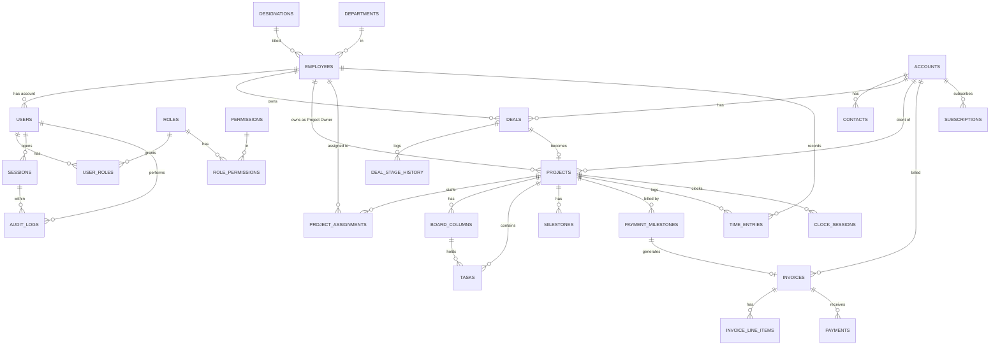

# Database Blueprint — SENYX ERP System

## 1. Database Technology

| Concern | Choice |
|---|---|
| **Engine** | PostgreSQL 15+ (via Supabase) |
| **ORM** | Drizzle ORM (TypeScript-first) |
| **IDs** | UUID v4 (`gen_random_uuid()`) |
| **Timestamps** | `timestamptz` stored in UTC |
| **Money** | `numeric(14,2)` + `char(3)` ISO-4217 currency |
| **Percentages** | `numeric(5,2)` (0–100) |
| **Hours** | `numeric(6,2)` |
| **Soft Deletes** | `deleted_at timestamptz` (NULL = active) |
| **Row-Level Security** | Enabled on all business tables |
| **Extensions** | `citext`, `pgcrypto`, `uuid-ossp` |

---

## 2. Complete Table Inventory (37 Tables)

### Group A — Identity & RBAC (6 tables)

```
┌──────────────────┐     ┌──────────────────┐     ┌──────────────────┐
│     users        │     │     roles        │     │   permissions    │
│──────────────────│     │──────────────────│     │──────────────────│
│ id (PK)          │     │ id (PK)          │     │ id (PK)          │
│ employee_id (FK) │──┐  │ name             │     │ module           │
│ email (UNIQUE)   │  │  │ description      │     │ action           │
│ is_active        │  │  │ is_system        │     │ scope            │
│ two_factor_on    │  │  │ + base columns   │     │ description      │
│ last_login_at    │  │  └────────┬─────────┘     │ + base columns   │
│ + base columns   │  │           │               └────────┬─────────┘
└────────┬─────────┘  │           │                        │
         │            │  ┌────────▼─────────┐    ┌─────────▼────────┐
         │            │  │  role_permissions │    │                  │
         │            │  │──────────────────│    │                  │
         │            │  │ role_id (PK,FK)  │    │                  │
         │            │  │ permission_id    │◄───┘                  │
         │            │  │   (PK,FK)        │                       │
         │            │  └──────────────────┘                       │
         │            │                                             │
         │            │  ┌──────────────────┐                       │
         │            │  │   user_roles     │                       │
         │            │  │──────────────────│                       │
         │            │  │ user_id (PK,FK)  │◄── users              │
         │            │  │ role_id (PK,FK)  │◄── roles              │
         │            │  └──────────────────┘                       │
         │            │                                             │
         │            │  ┌──────────────────┐                       │
         │            │  │    sessions      │                       │
         │            │  │──────────────────│                       │
         │            │  │ id (PK)          │                       │
         │            │  │ user_id (FK)     │◄── users              │
         │            │  │ started_at       │                       │
         │            │  │ ended_at         │                       │
         │            │  │ duration_seconds │                       │
         │            │  │ ip_address       │                       │
         │            │  │ device/os/browser│                       │
         │            │  │ is_active        │                       │
         │            │  └──────────────────┘                       │
         │            │                                             │
         │            ▼                                             │
```

### Group B — HR & People (10 tables)

```
┌──────────────────┐     ┌──────────────────┐     ┌──────────────────┐
│  departments     │     │  designations    │     │     skills       │
│──────────────────│     │──────────────────│     │──────────────────│
│ id (PK)          │     │ id (PK)          │     │ id (PK)          │
│ name (UNIQUE)    │     │ title (UNIQUE)   │     │ name (UNIQUE)    │
│ description      │     │ description      │     │ category         │
│ + base columns   │     │ + base columns   │     │ + base columns   │
└────────┬─────────┘     └────────┬─────────┘     └────────┬─────────┘
         │                        │                         │
         │               ┌───────▼──────────────────────────▼─────┐
         └──────────────►│         employees                      │
                         │────────────────────────────────────────│
                         │ id (PK)                                │
                         │ employee_code (UNIQUE) e.g. SNX-0001   │
                         │ first_name, last_name                  │
                         │ email (UNIQUE)                         │
                         │ phone                                  │
                         │ designation_id (FK → designations)     │
                         │ department_id (FK → departments)       │
                         │ manager_id (FK → employees) self-ref   │
                         │ employment_type (enum)                 │
                         │ start_date, end_date                   │
                         │ status (enum)                          │
                         │ salary (ENCRYPTED)                     │
                         │ bank_details (ENCRYPTED, JSONB)        │
                         │ national_id (ENCRYPTED)                │
                         │ emergency_contact (JSONB)              │
                         │ + base columns                         │
                         └──────────────┬─────────────────────────┘
                                        │
              ┌─────────────────────────┼────────────────────────┐
              ▼                         ▼                        ▼
  ┌──────────────────┐    ┌──────────────────┐    ┌──────────────────┐
  │ employee_skills  │    │  leave_requests  │    │ payroll_records  │
  │──────────────────│    │──────────────────│    │──────────────────│
  │ employee_id (PK) │    │ employee_id (FK) │    │ employee_id (FK) │
  │ skill_id (PK,FK) │    │ leave_type_id FK │    │ period_month     │
  │ proficiency 1-5  │    │ start/end_date   │    │ period_year      │
  │ certified        │    │ days, reason     │    │ gross (ENCRYPTED)│
  │ certified_at     │    │ status (enum)    │    │ deductions       │
  └──────────────────┘    │ approver_id (FK) │    │ net (ENCRYPTED)  │
                          │ decided_at       │    │ currency         │
  ┌──────────────────┐    │ + base columns   │    │ components JSONB │
  │  leave_types     │    └──────────────────┘    │ + base columns   │
  │──────────────────│                            └──────────────────┘
  │ name (UNIQUE)    │    ┌──────────────────┐
  │ default_annual_  │    │ leave_balances   │    ┌──────────────────┐
  │   days           │    │──────────────────│    │performance_reviews│
  └──────────────────┘    │ employee_id (FK) │    │──────────────────│
                          │ leave_type_id FK │    │ employee_id (FK) │
                          │ year             │    │ reviewer_id (FK) │
                          │ balance_days     │    │ period           │
                          │ UNIQUE(emp,type, │    │ rating 1-5       │
                          │   year)          │    │ goals JSONB      │
                          └──────────────────┘    │ notes            │
                                                  └──────────────────┘
```

### Group C — CRM (5 tables + 1 polymorphic)

```
┌──────────────────┐          ┌──────────────────┐
│    accounts      │──────────│    contacts      │
│──────────────────│    1:N   │──────────────────│
│ id (PK)          │          │ id (PK)          │
│ name             │          │ account_id (FK)  │
│ industry         │          │ first/last_name  │
│ size             │          │ email, phone     │
│ website          │          │ title            │
│ address JSONB    │          │ is_primary       │
│ status (enum)    │          │ + base columns   │
│ owner_id (FK→emp)│          └──────────────────┘
│ + base columns   │
└────────┬─────────┘          ┌──────────────────┐
         │                    │  interactions    │
         │              1:N   │──────────────────│
         ├───────────────────►│ account_id (FK)  │
         │                    │ contact_id (FK)  │
         │                    │ type (enum)      │
         │                    │ subject, notes   │
         │                    │ occurred_at      │
         │                    │ logged_by (FK)   │
         │                    └──────────────────┘
         │
         │                    ┌──────────────────┐
         │                    │   activities     │ (polymorphic — relates to any entity)
         │                    │──────────────────│
         │                    │ subject, type    │
         │                    │ due_date         │
         │                    │ assignee_id (FK) │
         │                    │ related_type     │
         │                    │ related_id       │
         │                    │ status (enum)    │
         │                    └──────────────────┘
         │
         │    ┌──────────────────┐    ┌──────────────────┐
         │    │      tags        │    │    taggables     │ (polymorphic join)
         │    │──────────────────│    │──────────────────│
         │    │ id (PK)          │    │ tag_id (PK,FK)   │
         │    │ name (UNIQUE)    │    │ taggable_type PK │
         │    └──────────────────┘    │ taggable_id PK   │
         │                            └──────────────────┘
         ▼
```

### Group D — Sales (3 tables)

```
┌──────────────────────┐
│       deals          │
│──────────────────────│
│ id (PK)              │
│ name                 │
│ account_id (FK)      │◄── accounts
│ owner_id (FK)        │◄── employees (any employee can own a deal)
│ amount numeric(14,2) │
│ currency char(3)     │
│ stage (enum)         │
│ probability 0-100    │
│ expected_close_date  │
│ source               │
│ status (enum)        │
│ win_loss_reason      │
│ last_activity_at     │
│ closed_at            │
│ + base columns       │
└──────┬──────┬────────┘
       │      │
       │      ▼
       │  ┌──────────────────┐
       │  │deal_stage_history│ (append-only)
       │  │──────────────────│
       │  │ deal_id (FK)     │
       │  │ from_stage       │
       │  │ to_stage         │
       │  │ changed_by (FK)  │
       │  │ changed_at       │
       │  └──────────────────┘
       │
       ▼
  ┌──────────────────┐
  │     quotes       │
  │──────────────────│
  │ deal_id (FK)     │
  │ amount, currency │
  │ valid_until      │
  │ status           │
  │ document_id (FK) │◄── documents
  │ + base columns   │
  └──────────────────┘
```

### Group E — Projects (9 tables)

```
┌───────────────────────────┐
│        projects           │
│───────────────────────────│
│ id (PK)                   │
│ code (UNIQUE) PRJ-0007    │
│ name                      │
│ type (solution/product)   │
│ account_id (FK)           │◄── accounts (required for solutions)
│ deal_id (FK)              │◄── deals (source deal)
│ owner_id (FK)             │◄── employees (Project Owner)
│ billing_type (enum)       │
│ status (enum)             │
│ start/end_date            │
│ budget, currency          │
│ + base columns            │
└────┬───┬───┬───┬──────────┘
     │   │   │   │
     │   │   │   ├──► project_assignments ──► employees
     │   │   │   │    (who worked on which project)
     │   │   │   │
     │   │   │   ├──► board_columns ──► tasks
     │   │   │   │    (Kanban board)   (cards, drag-drop)
     │   │   │   │
     │   │   │   ├──► milestones (delivery milestones)
     │   │   │   │
     │   │   │   ├──► payment_milestones ──► invoices
     │   │   │   │    (% of project value, sum=100)
     │   │   │   │
     │   │   │   ├──► time_entries ──► employees
     │   │   │   │    (manual + clock source)
     │   │   │   │
     │   │   │   ├──► clock_sessions ──► employees
     │   │   │   │    (clock in/out, one active per employee)
     │   │   │   │
     │   │   │   └──► project_risks
     │   │   │        (risk/issue log)
```

### Group F — Finance (5 tables)

```
┌──────────────────────┐
│      invoices        │
│──────────────────────│
│ id (PK)              │
│ invoice_number       │  INV-2026-0042
│ account_id (FK)      │
│ project_id (FK)      │
│ deal_id (FK)         │
│ payment_milestone_id │◄── payment_milestones
│ issue_date, due_date │
│ subtotal, tax, total │
│ currency, status     │
│ paid_at              │
│ + base columns       │
└──────┬───────────────┘
       │
       ├──► invoice_line_items (description, qty, unit_price, amount)
       │
       └──► payments (method, amount, reference, exchange_rate)
                │
                └──► also linked to expenses

┌──────────────────────┐     ┌──────────────────────┐
│     expenses         │     │    subscriptions     │ (AI product recurring)
│──────────────────────│     │──────────────────────│
│ vendor, category     │     │ account_id (FK)      │
│ amount, currency     │     │ product_name, plan   │
│ expense_date         │     │ amount, currency     │
│ project_id (FK)      │     │ interval (enum)      │
│ approval_status      │     │ status (enum)        │
│ approver_id (FK)     │     │ started_at           │
│ receipt_document_id  │     │ current_period_end   │
│ + base columns       │     │ mrr (computed)       │
└──────────────────────┘     └──────────────────────┘
```

### Group G — Platform (5 tables)

```
┌──────────────────────┐     ┌──────────────────────┐
│     documents        │     │   notifications      │
│──────────────────────│     │──────────────────────│
│ storage_key (R2)     │     │ user_id (FK)         │
│ file_name            │     │ type, title, body    │
│ mime_type            │     │ related_type/id      │
│ size_bytes           │     │ channel (in_app/     │
│ owner_type/id        │     │   email)             │
│ uploaded_by (FK)     │     │ is_read, sent_at     │
│ + base columns       │     │ + base columns       │
└──────────────────────┘     └──────────────────────┘

┌──────────────────────┐     ┌──────────────────────┐
│    audit_logs        │     │ reminder_schedules   │
│──────────────────────│     │──────────────────────│
│ APPEND-ONLY          │     │ name, type, target   │
│ actor_id (FK→users)  │     │ advance_days [7,3,1] │
│ role_in_effect       │     │ digest_time          │
│ session_id (FK)      │     │ is_active            │
│ action               │     │ + base columns       │
│ api_route            │     └──────────────────────┘
│ entity_type/id       │
│ before/after JSONB   │     ┌──────────────────────┐
│ device, os, browser  │     │     settings         │
│ ip_address           │     │──────────────────────│
│ result (enum)        │     │ key (UNIQUE)         │
│ error_code           │     │ value JSONB          │
│ created_at           │     │ + base columns       │
└──────────────────────┘     └──────────────────────┘
```

---

## 3. Entity Relationships (ERD)



---

## 4. Indexing Strategy

### 4.1 Foreign Key Indexes (All FK columns — PostgreSQL does not auto-index)

```sql
-- Every FK column needs an index for join performance
CREATE INDEX idx_users_employee_id ON users(employee_id);
CREATE INDEX idx_employees_designation_id ON employees(designation_id);
CREATE INDEX idx_employees_department_id ON employees(department_id);
CREATE INDEX idx_employees_manager_id ON employees(manager_id);
CREATE INDEX idx_deals_account_id ON deals(account_id);
CREATE INDEX idx_deals_owner_id ON deals(owner_id);
CREATE INDEX idx_projects_account_id ON projects(account_id);
CREATE INDEX idx_projects_deal_id ON projects(deal_id);
CREATE INDEX idx_projects_owner_id ON projects(owner_id);
CREATE INDEX idx_tasks_project_id ON tasks(project_id);
CREATE INDEX idx_tasks_column_id ON tasks(column_id);
CREATE INDEX idx_tasks_assignee_id ON tasks(assignee_id);
-- ... (all FK columns)
```

### 4.2 Soft-Delete Partial Indexes (Hot tables)

```sql
CREATE INDEX idx_deals_active ON deals(id) WHERE deleted_at IS NULL;
CREATE INDEX idx_projects_active ON projects(id) WHERE deleted_at IS NULL;
CREATE INDEX idx_tasks_active ON tasks(id) WHERE deleted_at IS NULL;
CREATE INDEX idx_invoices_active ON invoices(id) WHERE deleted_at IS NULL;
CREATE INDEX idx_employees_active ON employees(id) WHERE deleted_at IS NULL;
```

### 4.3 Domain-Specific Indexes

```sql
-- Audit & Sessions (high volume, frequent filtering)
CREATE INDEX idx_audit_actor_time ON audit_logs(actor_id, created_at);
CREATE INDEX idx_audit_entity ON audit_logs(entity_type, entity_id);
CREATE INDEX idx_audit_api_route ON audit_logs(api_route);
CREATE INDEX idx_sessions_user_time ON sessions(user_id, started_at);

-- Kanban Board
CREATE INDEX idx_tasks_board ON tasks(project_id, column_id, position);

-- Clock (one active per employee)
CREATE UNIQUE INDEX idx_clock_active ON clock_sessions(employee_id) WHERE is_active = true;

-- Finance
CREATE INDEX idx_invoices_status_due ON invoices(status, due_date);
CREATE INDEX idx_payment_milestones_proj ON payment_milestones(project_id, status);

-- Sales
CREATE INDEX idx_deals_owner_stage ON deals(owner_id, stage);
CREATE INDEX idx_deals_status_close ON deals(status, expected_close_date);

-- Full-text search (GIN)
CREATE INDEX idx_accounts_search ON accounts USING GIN (to_tsvector('english', name));
CREATE INDEX idx_projects_search ON projects USING GIN (to_tsvector('english', name));
CREATE INDEX idx_deals_search ON deals USING GIN (to_tsvector('english', name));
```

---

## 5. Row-Level Security (RLS) Policies

### 5.1 Helper Functions

```sql
-- Get current user's employee ID from JWT
CREATE OR REPLACE FUNCTION current_employee_id()
RETURNS uuid AS $$
  SELECT employee_id FROM users WHERE id = auth.uid()
$$ LANGUAGE sql SECURITY DEFINER STABLE;

-- Check if current user has a specific scope
CREATE OR REPLACE FUNCTION current_has_scope(
  p_module text, p_action text, p_scope text
) RETURNS boolean AS $$
  SELECT EXISTS (
    SELECT 1
    FROM user_roles ur
    JOIN role_permissions rp ON rp.role_id = ur.role_id
    JOIN permissions p ON p.id = rp.permission_id
    WHERE ur.user_id = auth.uid()
      AND p.module = p_module
      AND p.action = p_action
      AND p.scope = p_scope
  )
$$ LANGUAGE sql SECURITY DEFINER STABLE;
```

### 5.2 Policy Examples

```sql
-- Deals: own scope (Employee) + all scope (Sales Lead/Admin)
ALTER TABLE deals ENABLE ROW LEVEL SECURITY;

CREATE POLICY deals_select ON deals FOR SELECT USING (
  deleted_at IS NULL AND (
    current_has_scope('sales', 'view', 'all')
    OR owner_id = current_employee_id()
  )
);

CREATE POLICY deals_insert ON deals FOR INSERT WITH CHECK (
  current_has_scope('sales', 'create', 'all')
  OR current_has_scope('sales', 'create', 'own')
);

CREATE POLICY deals_update ON deals FOR UPDATE USING (
  current_has_scope('sales', 'edit', 'all')
  OR owner_id = current_employee_id()
);

-- Projects: assigned scope
ALTER TABLE projects ENABLE ROW LEVEL SECURITY;

CREATE POLICY projects_select ON projects FOR SELECT USING (
  deleted_at IS NULL AND (
    current_has_scope('projects', 'view', 'all')
    OR owner_id = current_employee_id()
    OR id IN (
      SELECT project_id FROM project_assignments
      WHERE employee_id = current_employee_id() AND unassigned_at IS NULL
    )
  )
);
```

---

## 6. Database Triggers & Functions

```sql
-- Auto-update updated_at on every UPDATE
CREATE OR REPLACE FUNCTION update_updated_at()
RETURNS trigger AS $$
BEGIN
  NEW.updated_at = now();
  RETURN NEW;
END;
$$ LANGUAGE plpgsql;

-- Apply to all business tables
CREATE TRIGGER trg_updated_at BEFORE UPDATE ON employees
FOR EACH ROW EXECUTE FUNCTION update_updated_at();
-- ... repeat for all tables with updated_at

-- Validate payment milestone percentages sum to 100
CREATE OR REPLACE FUNCTION validate_payment_milestone_sum()
RETURNS trigger AS $$
DECLARE
  total numeric;
BEGIN
  SELECT SUM(percentage) INTO total
  FROM payment_milestones
  WHERE project_id = NEW.project_id AND deleted_at IS NULL;
  
  IF total > 100 THEN
    RAISE EXCEPTION 'Payment milestone percentages exceed 100%% (current: %%)',
      total;
  END IF;
  
  RETURN NEW;
END;
$$ LANGUAGE plpgsql;

CREATE CONSTRAINT TRIGGER trg_payment_milestone_sum
AFTER INSERT OR UPDATE ON payment_milestones
DEFERRABLE INITIALLY DEFERRED
FOR EACH ROW EXECUTE FUNCTION validate_payment_milestone_sum();

-- Compute clock session duration on clock-out
CREATE OR REPLACE FUNCTION compute_clock_duration()
RETURNS trigger AS $$
BEGIN
  IF NEW.clock_out_at IS NOT NULL AND OLD.clock_out_at IS NULL THEN
    NEW.duration_seconds = EXTRACT(EPOCH FROM (NEW.clock_out_at - NEW.clock_in_at))::integer;
    NEW.is_active = false;
  END IF;
  RETURN NEW;
END;
$$ LANGUAGE plpgsql;

CREATE TRIGGER trg_clock_duration BEFORE UPDATE ON clock_sessions
FOR EACH ROW EXECUTE FUNCTION compute_clock_duration();
```

---

## 7. Seed Data

```sql
-- Default roles
INSERT INTO roles (name, description, is_system) VALUES
  ('Admin', 'Full system access', true),
  ('Finance', 'Finance module full access', true),
  ('HR Manager', 'HR module full access', true),
  ('Sales Lead', 'Sales full access, all deals', true),
  ('Project Owner', 'Full access to owned projects', true),
  ('Employee', 'Default role for all staff', true),
  ('Auditor', 'Read-only audit access', false);

-- Default designations
INSERT INTO designations (title) VALUES
  ('CEO'), ('CTO'), ('COO'),
  ('Project Manager'), ('Senior Developer'), ('Developer'),
  ('ML Engineer'), ('Data Scientist'), ('Business Analyst'),
  ('UI/UX Designer'), ('QA Engineer'), ('DevOps Engineer'),
  ('HR Executive'), ('Finance Executive'), ('Sales Executive');

-- Default leave types
INSERT INTO leave_types (name, default_annual_days) VALUES
  ('Annual Leave', 14),
  ('Sick Leave', 7),
  ('Casual Leave', 7),
  ('Maternity Leave', 84),
  ('Paternity Leave', 3);

-- Default settings
INSERT INTO settings (key, value) VALUES
  ('company.name', '"SENYX Software (Pvt) Ltd"'),
  ('company.currency', '"LKR"'),
  ('finance.tax_rate', '0'),
  ('invoice.auto_issue', 'false'),
  ('session.timeout_minutes', '480'),
  ('session.max_concurrent', '3');
```

---

## 8. Backup Strategy

```
Daily @ 02:00 UTC:
  1. pg_dump → compressed SQL file
  2. Upload to Cloudflare R2 (senyx-erp-backups bucket)
  3. Retain 30 daily + 12 monthly backups
  4. Log backup result in audit_logs
  5. Periodic restore test (monthly)
```

---

## 9. Migration Strategy

```
Drizzle ORM Migration Workflow:
  1. Modify schema files in src/server/db/schema/
  2. Generate migration: npx drizzle-kit generate
  3. Review generated SQL in drizzle/ folder
  4. Apply migration: npx drizzle-kit push (dev) or migrate (prod)
  5. Seed new data if needed
  6. Test with existing data
```

---

*This blueprint defines the complete database architecture. See the Frontend and Backend Blueprints for application layer details.*
